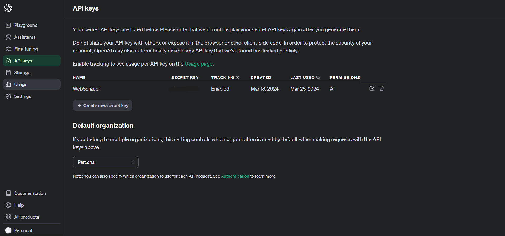

# CS_325 Project 3
An extension of the Python web scraper for [RACER.com](https://racer.com) news articles, using OpenAI's API for text generation.

## Table of Contents
- [Description](#Description)
    - [Project Rules](#the-rules)
- [Instructions](#instructions)
    - [Creating an OpenAI API Key](#creating-an-openai-api-key)
    - [Using the API Key](#using-the-api-key)
    - [Installing Dependencies](#installing-dependencies)
    - [Running the Script](#running-the-script-finally)
        - [Using Anaconda](#using-anaconda)
        - [Using VS Code](#using-vs-code)
- [Changes and Additions](#changesadditions-from-project-2)
    - [Module 1](#module1function1-file-processing-module)
    - [Module 2](#module2function2-data-processing-module)
    - [Module 3](#module3function3-openai-summarization-module)
    - [Main Module](#main-module-runpy)
- [Adhering to SOLID](#adhering-to-solid-principle)

## Description
Project 3 aims to implement OpenAI's AI text generation to summarize each sanitized article in a concise manner. 

### The Rules:
1. Create a different branch under Project 2's repo.
2. Write a program that will connect to **OpenAI/Gemini(Bard)** using an API key/token, and document the API key creation process.
3. Send the LLM model a prompt in order to create and return a concise summary of the articles taken in from BeautifulSoup.
4. Save the return text in a file. This file should contain the original title of the content and the concise article.
5. Implement the file/folder stucture from Project 2.
6. Complete the article summarization for at least 10 articles.
7. Document all code with comments and update the YML/YAML file as needed.

## Instructions
### Creating an OpenAI API Key
In order to summarize the articles, you will need to generate an **API token** from OpenAI, the company we all know and love for creating ChatGPT.
1. If you do not have an OpenAI account, create one at [OpenAI's website](https://platform.openai.com/).
2. Once you have successfully created an account, you will need to navigate to the OpenAI [**API Keys page**](https://platform.openai.com/api-keys), which should look like this: 
3. Click `Create new secret key` and make sure to set Permissions to `all`.
4. Once you create an API key, **make sure to save it somewhere safe**. It is very important to keep your API key private to yourself to avoid any hijacking situations.
5. At this point, feel free to download/clone this repo (if you haven't already.)
### Using the API Key
You will need to create an environment file to implement your own personal API key.
1. Open up Notepad or any plain text editor. 
2. Next, define a variable called `OPENAI_API_KEY` (**this EXACT name**), and set it equal to your API key. It should look something like this: `OPENAI_API_KEY=your-api-key`.
3. Save this file as a `.env` file inside the main `CS325_p3` folder.
4. If the first three steps are done correctly, upon running the main Python module (**run.py**), you will be able to see this reflected in the output where each URL is being processed.
### Installing Dependencies
Much like Project 1 and Project 2, you will need to create the working environment from the YML file, which includes all the necessary dependencies/libraries for Python. These steps assume that Anaconda is already installed. If it isn't, refer to the **main** branch README.
1. Open up Anaconda by typing anaconda prompt in the Windows Start menu.
2. In Anaconda, navigate to the directory that the unzipped repo files are located in as a check so that all repo files are visible.
3. Initialize the Python environment by typing `conda create -f requirements.yml`. This will automatically install any necessary dependencies for running the script.
### Running the Script (finally...)
You have two options: using Anaconda's CLI or using an IDE like Visual Studio Code.
#### Using Anaconda
1. Open up Anaconda by typing ```anaconda prompt``` in the Windows Start menu. 
2. In Anaconda, navigate to the directory that the unzipped repo files are located in.
3. Type ```python main.py``` in the CLI. If no errors appear after pressing Enter, it means that the five articles were written successfully. 
#### Using VS Code
4. If you have Visual Studio Code installed, you can change the environment (lower right-hand side) to the Anaconda environment and run from there.
5. Feel free to edit the `url.txt` file to swap in other RACER.com articles. Any added articles and their summarizations will overwrite existing files.

## Changes/Additions from Project 2
### **module1/function1** (file-processing module)
- `def write_summary_to_file(paragraph_array, filename, title) -> None`:
Added this function to properly write the OpenAI article summary to a file, appending the title as the first line of the summary. Note that this function creates a new line whenever a period is used within a sentence to quickly create more readble content. However, this leads to some weird formatting with abbreviations where a sentence will be split on things like `A.B.C`. I imagine we could use something like `regex` to properly do this, but that isn't the scope of this assignment.
### **module2/function2** (data-processing module)
- `def get_article_title(url) -> str`:
Added this function to get a title given an article's URL. Previously in Project 2 I retreived the file in the sanitzed article function, but for this increment we need to save the title in both the sanitized article and its cooresponding summary.
### **module3/function3** (OpenAI summarization module)
- `def get_summary(filename) -> str`:
This represents the main goal of this project. Using the API key, we can feed a prompt asking for a concise summary of a sanitized article, i.e. the **filename** passed in. I modified the default `temperature` value to 0 so that outputs are more deterministic (i.e. adhering to 50 words).
### **main** module (run.py)
- Added a safeguard to create the `/Raw`, `/OpenAISummarization`, and `/Full` (sanitized) directories if they aren't existing or somehow get deleted. Feel free to remove all the files and change the input (url.txt) files to your liking with other RACER.com files.
- Added print statements to indicate which files are being written to.

## Adhering to SOLID Principle
Much like Project 2, I tried to maintain the SRP of SOLID, that is, each function itself has a single responsibility to maintain. 


