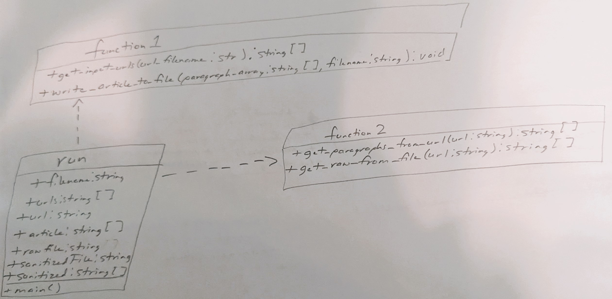

# CS_325 Project 2
An extension of the Python web scraper for [RACER.com](https://racer.com) news articles

## Table of Contents
- [Description](#Description)
    - [Project Rules](#the-rules)
- [Modules](#modules)
    - [Module 1](#module1function1)
    - [Module 2](#module2function2)
- [Adhering to SOLID](#adhering-to-solid-principle)
- [Class Diagram](#class-diagram)
    - [Run/function1 Relationship](#runfunction1-relationship)
    - [Run/function2 Relationship](#runfunction2-relationship)
    - [function1/function2 Relationship](#function1function2-relationship)

## Description
Project 2 aims to refactor the existing web scraper of Project 1 by logically breaking down the code into two separate modules, adding a specified folder structure, and implementing a SOLID principle. 

### The Rules:
1. Break down your project-1 code into logically two different files/modules, and use `import` to call the functionality of one file into another.
2. Create `Data/Raw` folder for unprocessed files, `Data/Processed` folder for sanitized/cleaned articles.
3. `run.py` function will contain main function which will call the rest of the modules.
4. Document all code with comments at the top of each file, stating inputs/outputs for each module as well as working for each module.
5. Implement one of the five SOLID principles.
6. Create a class diagram of the entire program.

## Modules
### `module1/function1`
File-processing module that opens/reads input URL file, and writes the content of each article to a specified filename.

**Functions**:
- `get_input_urls(url_filename: string) -> string []`
    - Returns a list of the URLS that are located in the `url.txt` file.
- `write_article_to_file(paragraph_array: string [], filename: string)`: 
    - Writes the article content to a specified filename, either in the `raw` or `processed` folder.

### `module2/function2`
Data-processing module that gathers the raw or sanitzed content of a scraped article.
**Functions**:
-  `def get_paragraphs_from_url(url: string) -> string []`:
    - Returns the list of sanitized paragraphs of an article to later be written to a file.
-  `get_raw_from_file(url: string) -> string []`:
    - Returns the list of unsantitized/raw paragraphs of an article to later be written to a file.

## Adhering to SOLID Principle
- Each of the modules adhere to the Single Responsibility Principle (SRP) of SOLID.
    - Each function itself has a single responsibility to maintain. 

## Class Diagram

### run/function1 relationship
- Relationship: Dependency
    - Run imports the `function1` module in order to use `get_input_urls` as well as `write_article_to_file`.

### run/function2 relationship
- Relationship: Dependency
    - Run imports the `function2` module in order to use `get_paragraphs_from_url` as well as `get_raw_from_file`.

### function1/function2 relationship
- There does not exist a relationship between these two modules as they do not directly need each other to work properly.

